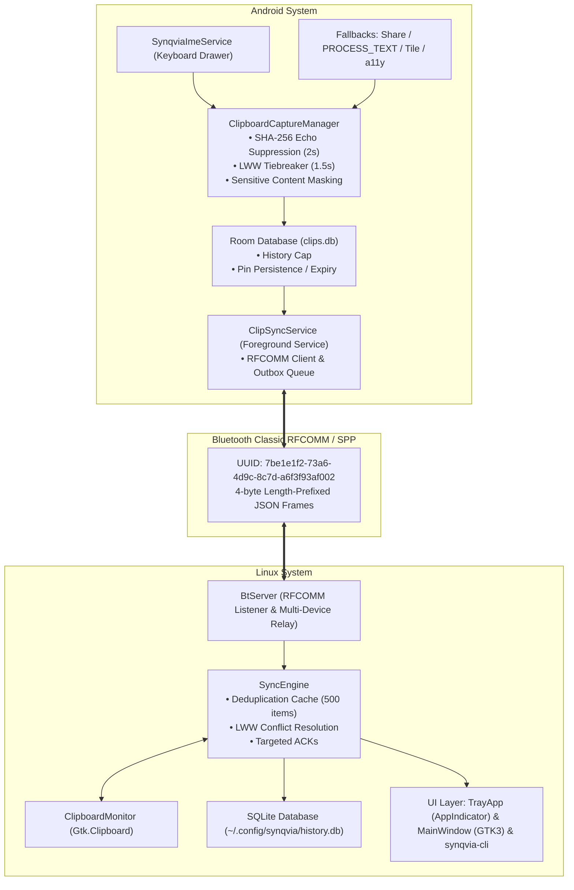

<p align="center">
  <!-- LOGO PLACEHOLDER: Replace this placeholder comment and image with your official Synqvia logo/wordmark asset -->
  
</p>

<h1 align="center">Synqvia</h1>

<p align="center">
  <strong>Instant local clipboard handoff</strong>
</p>

<p align="center">
  <a href="https://github.com/premtechworks/Synqvia/releases"></a>
  <a href="LICENSE"></a>
  
  
  <a href="PROTOCOL.md"></a>
</p>

---

Synqvia is a privacy-first, offline-first clipboard synchronization tool between Android and Linux. It pairs devices directly over **Bluetooth Classic (RFCOMM/SPP)** with length-prefixed framing and a native Android Input Method Editor (IME) drawer for zero-friction capture and 1-tap pasting.

---

## Table of Contents

- [Why Synqvia](#why-synqvia)
- [Features](#features)
- [Screenshots](#screenshots)
- [Architecture](#architecture)
- [Installation](#installation)
  - [Android](#android)
  - [Linux (Debian / Ubuntu / Mint / Xfce)](#linux-debian--ubuntu--mint--xfce)
- [Pairing & Setup](#pairing--setup)
- [Input Pathways & Fallbacks](#input-pathways--fallbacks)
- [Contributing](#contributing)
- [License](#license)
- [Links](#links)

---

## Why Synqvia

Traditional clipboard sharing applications rely on cloud servers, external relays, or local Wi-Fi networks requiring user logins and telemetry:

- **100% Private & Local**: Your clipboard data—which often includes passwords, two-factor auth tokens, private messages, and API keys—never touches the internet, third-party relays, or proprietary servers. Everything travels directly over your local Bluetooth radio.
- **True Offline Operation**: Works without an internet connection, without Wi-Fi router association, and without user accounts or login credentials.
- **Sanctioned Android 10–14+ Clipboard Integration**: Modern Android restricts background clipboard inspection (`ClipboardManager.getPrimaryClip()`). Synqvia solves this cleanly via an Input Method Editor (`SynqviaImeService`), granting fully compliant foreground access and direct 1-tap paste into any app without root permissions, adb permissions, or private OS bypasses.

---

## Features

- 🔒 **Bluetooth Classic RFCOMM/SPP Transport**: Persistent bidirectional stream over Bluetooth Classic using dedicated UUID `7be1e1f2-73a6-4d9c-8c7d-a6f3f93af002`. Features length-prefixed JSON frames, keepalive heartbeats, and acknowledgements.
- ⌨️ **Gboard-Style IME Keyboard Drawer**: Quick-access clipboard drawer in any input field with 1-tap pasting directly into the focused editor via `InputConnection.commitText()`.
- 📌 **Pinning & 1-Hour Expiry**: Pin critical snippets indefinitely; unpinned clips safely expire from the keyboard view after 1 hour (while remaining preserved in the permanent sync history).
- 🛡️ **Sensitive Data Masking**: Automatic classifier detects authorization tokens, passwords, and API keys, masking them in the keyboard UI (`•••••••• (Sensitive Content)`).
- ⚡ **Deterministic LWW Conflict Resolution**: Resolves concurrent edits within 1500ms using `(timestamp, src_id)` tiebreakers, preserving loser entries in history without rebroadcast loops.
- 🔄 **SHA-256 Echo Suppression**: 2000ms suppression hash window prevents remote clips applied to the system clipboard from echoing back.
- 📦 **Offline Outbox & Auto-Sync**: Copies made while disconnected queue in SQLite (Linux) and Room (Android), automatically flushing in chronological order upon reconnection.
- 👥 **Multi-Device Relay**: The Linux daemon coordinates multiple concurrent Android devices, broadcasting clips and relaying cross-device copies seamlessly.
- 🐧 **Native Linux Desktop UI & CLI**: Features an Ayatana AppIndicator / GTK3 status tray, a responsive management window, and a standalone headless CLI (`synqvia-cli`).

---

## Screenshots

<!-- 
NOTE FOR MAINTAINER:
Replace the placeholder image paths below with actual screenshots of your running Synqvia instance.
Recommended locations: docs/screenshots/android_ime_panel.png, docs/screenshots/linux_tray.png, docs/screenshots/linux_window.png
-->

| Android IME Panel (Placeholder) | Linux System Tray (Placeholder) | Linux Window (Placeholder) |
| :---: | :---: | :---: |
|  |  |  |
| *1-tap paste & pinned clips drawer* | *Ayatana AppIndicator & quick history* | *GTK3 history, pairing & live logs* |

---

## Architecture

Synqvia separates clipboard observation and injection from the underlying Bluetooth transport using a decoupled pipeline:



For the complete packet structure and wire protocol specifications, see [PROTOCOL.md](PROTOCOL.md).

---

## Installation

### Android

1. Download the latest signed release APK (`synqvia-v1.0.0.apk`) or bundle (`synqvia-v1.0.0.aab`) from the [Releases page](https://github.com/premtechworks/Synqvia/releases).
2. Install the APK via ADB or by opening it on your device:
   ```bash
   adb install synqvia-v1.0.0.apk
   ```
3. Enable the **Synqvia Keyboard**:
   - Open **Settings → System → Languages & input → On-screen keyboard** (or **Manage keyboards**).
   - Toggle **Synqvia Keyboard** to **ON**.
4. Open the Synqvia app, grant required Bluetooth permissions, and exempt the app from battery optimization so background sync remains active.

---

### Linux (Debian / Ubuntu / Mint / Xfce)

#### Option 1: Prebuilt `.deb` Package (Recommended)

1. Download the `.deb` package from the [Releases page](https://github.com/premtechworks/Synqvia/releases):
   ```bash
   wget https://github.com/premtechworks/Synqvia/releases/download/v1.0.0/synqvia_1.0.0_all.deb
   sudo apt install ./synqvia_1.0.0_all.deb
   ```
2. The package automatically installs:
   - Daemon binary: `/usr/local/bin/synqvia`
   - CLI utility: `/usr/local/bin/synqvia-cli`
   - Python library: `/usr/local/lib/synqvia/synqvia/`
   - Autostart entry: `/etc/xdg/autostart/synqvia.desktop`
   - Desktop application launcher: `/usr/share/applications/synqvia.desktop`

#### Option 2: From Source via `install.sh`

System dependencies required: `python3`, `python3-gi`, `gir1.2-gtk-3.0`, `gir1.2-ayatanaappindicator3-0.1`, `bluez`, `python3-pip`, `libbluetooth-dev`.

```bash
git clone https://github.com/premtechworks/Synqvia.git
cd Synqvia/linux
./install.sh
```

---

## Pairing & Setup

Before connecting inside the app, devices must be paired at the OS level:

1. **Pair over Bluetooth**:
   - Open a terminal on Linux and run `bluetoothctl`:
     ```bash
     bluetoothctl
     [bluetooth]# power on
     [bluetooth]# discoverable on
     [bluetooth]# pairable on
     ```
   - On Android: open **Settings → Connected devices → Pair new device**, select your PC, and confirm the pairing code on both screens.
   - On Linux: trust the device:
     ```bash
     [bluetooth]# trust <ANDROID_MAC>
     ```

2. **Retrieve PC Bluetooth Adapter Address**:
   ```bash
   bluetoothctl show | grep "Controller"
   # Example output: Controller AA:BB:CC:DD:EE:FF [default]
   ```

3. **Configure Synqvia**:
   - Open Synqvia on Android and navigate to the **✦ Setup** screen.
   - Enter your Linux Bluetooth MAC address (`AA:BB:CC:DD:EE:FF`).
   - Tap **Save & Connect**.
   - Start the Linux daemon:
     ```bash
     synqvia --show
     ```
   - The connection indicator turns green once connected.

---

## Input Pathways & Fallbacks

Synqvia normalizes all clipboard sources through `ClipboardCaptureManager`:

| Pathway | Trigger | Android Version | Redundancy Role |
| :--- | :--- | :--- | :--- |
| **IME Service** | Active keyboard drawer / switch to Synqvia | API 26 – 34+ | **Primary path**: direct foreground access and 1-tap paste |
| **Selection Action** | Highlight text → tap "Send to PC via Synqvia" | API 23+ | Direct manual handoff via `PROCESS_TEXT` |
| **Share Sheet** | Share Sheet → "Send to PC" | All APIs | Standard Android `ACTION_SEND` handoff |
| **Quick Settings Tile** | Swipe down QS → "Sync to PC" | API 24+ | Quick sync for recent selection via `TileService` |
| **Notification Action** | Tap "Sync to PC" in persistent notif | API 26+ | Fast trigger without opening main UI |
| **Accessibility Service** | Copy gesture text observation | API 26 – 34+ | Fallback when non-default IME is used |
| **Trampoline Activity** | Brief transparent focus grab | API 29+ | Auxiliary clipboard read fallback |

---

## Contributing

We welcome issues and pull requests!

### Reporting Issues
Please report bugs or request features on the [GitHub Issues](https://github.com/premtechworks/Synqvia/issues) tracker. Include your Linux distribution, Android OS version, and relevant logs (`synqvia-cli log -n 50` or `adb logcat -s Synqvia`).

### Development Setup & Testing

#### Android
- Requires Android Studio / JDK 17.
- Run tests:
  ```bash
  cd android
  ./gradlew test
  ```
- Build debug APK:
  ```bash
  ./gradlew assembleDebug
  ```

#### Linux
- Requires Python 3.10+ and GTK3 development headers.
- Run tests:
  ```bash
  python3 -m pytest tests/ -v
  ```

---

## License

This project is licensed under the **GNU General Public License v3.0** — see the [LICENSE](LICENSE) file for details.

---

## Links

- **Repository**: [github.com/premtechworks/Synqvia](https://github.com/premtechworks/Synqvia)
- **Releases**: [github.com/premtechworks/Synqvia/releases](https://github.com/premtechworks/Synqvia/releases)
- **Issue Tracker**: [github.com/premtechworks/Synqvia/issues](https://github.com/premtechworks/Synqvia/issues)
- **Wire Protocol**: [PROTOCOL.md](PROTOCOL.md)
- **QA & Test Plan**: [TEST_PLAN.md](TEST_PLAN.md)
